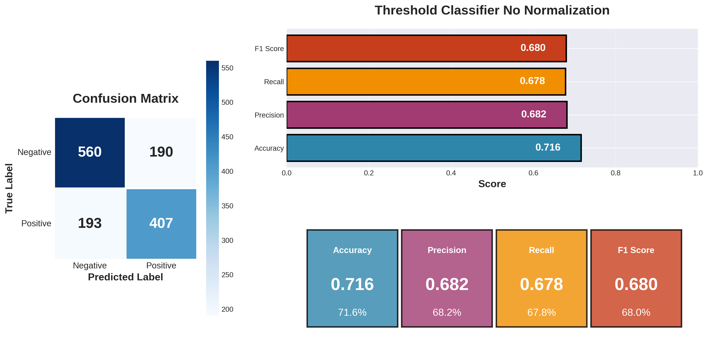
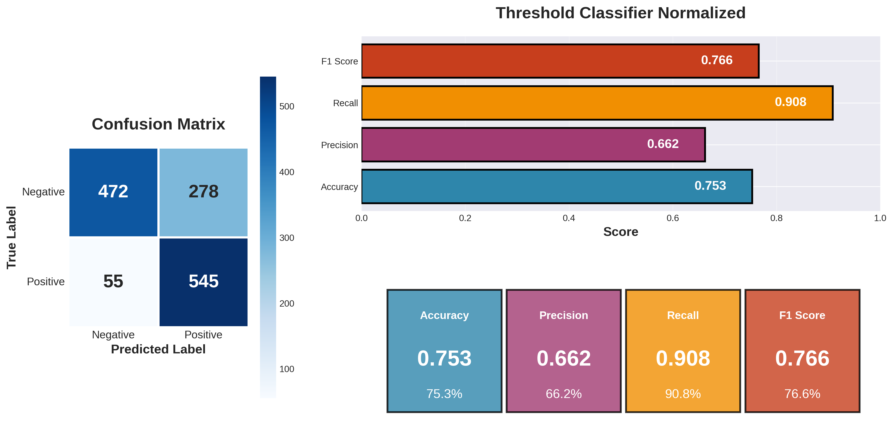

# patternrecognition-group1-groupexercise4

## Setup of the folders

```
PatternRecog4/
├─ data/
│  └─ SignatureVerification/
│     ├─ enrollment/        # TSVs with 5 genuine signatures per writer (001–030)
│     │  ├─ 001-g-01.tsv
│     │  ├─ 001-g-02.tsv
│     │  └─ ...
│     └─ verification/      # TSVs to be tested (genuine/forged)
│
├─ src/                     # Project modules
│  ├─ data_formatting.py    # Load TSVs and compute features (x,y,vx,vy,pressure)
│  └─ dtw.py                # DTW implementation (Sakoe–Chiba band)
│
├─ main.py                  # Demo/entry point
├─ pyproject.toml           # Package metadata (editable install)
└─ requirements.txt         # Python dependencies
```

# Implementation choice
In a first time, we implement a simple DTW logic with a simple treshold classifier (compare the candidate with the genuine, take the minimum distance compare to the five genuine, if the distance is greather than the threshold classified as forgery instead genuine). In a second time, because the threshold classifier classify in an acceptable accuracy, we tried to implement a normalization to see how much it improve the model.

## Improvement
All the code is in "basic" python, a reimplementation using numpy, can speedup the whole system. 

The code is not as clean as wanted especially because it use class instead of staying the whole time in vectors. A lot of computation can be avoided with a rewriting of the prototype.

# Results
_Excuse the plot it's ai generated_
## No normalisation


## Normalisation


## Discussion
As we can see in the results the normalisation permit to improve a bin the accuracy and F1 score. It's not exclude because of empiric caractere of the threshold that's it's only luck. 

An interesting fact is that the model capture close to 90% of the genuine signature against 68% for the non normalized version. In contrast, the precision decrease a little, meaning we accept some more forgeries signature as genuine. This problem can be probably balanced with a little bit of finetuning or another classifier.